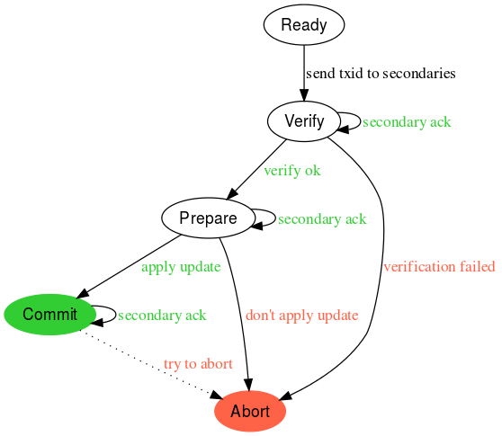

# Three-phase commit

## State machine

### Basic flow

The `Primary` is responsible for coordinating state machine transitions with a set number of `Secondary` ECUs per transaction.

Each step at the primary is broadcast to the relevant secondaries with optional payload data. Each secondary should log the message on receipt to persistent storage before applying it. After applying it should sending an acknowledgment to the primary on success, or an abort message otherwise.

The `Primary` will wait for the transactional number of acknowledgments at each step before moving to the next state. If it times out or receives an abort message it will short-circuit and move to the `Abort` state, broadcasting this decision to all secondaries.

### ECU failures

Atomically applying updates is on a best-effort basis, although three-phase commit should come to a collective `Commit` or `Abort` agreement most of the time.

One failure case might be the power from the ignition being cut after some secondaries agreed to `Commit` while others did not yet receive that message. If they came back online and were unable to receive confirmation from other ECUs of the commit decision they would eventually time-out and move to the `Abort` state.

While such split-brain scenarios should be rare, if any `Secondary` were to receive an `Abort` message after a `Commit` one it should try and abort if possible, or report success to the `Primary` otherwise.

### Some test cases

* Any ECU timing out in any state.
* Any ECU crashing then recovering at each state.
* Per-ECU payload delivery at each state.
* Multiple transactions on the same network.
* Large payload delivery.
* Fuzzed message parameters.
